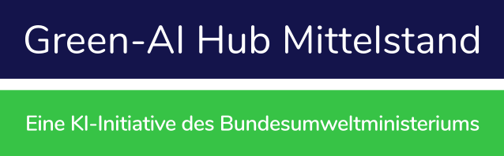

<a name="readme-top"></a>


<br />
<div align="center">
  <h1 align="center">Structural Capacity Computation Interface</h1>
  
  <p align="center">
    <a href="https://github.com/Green-AI-Hub-Mittelstand/readme_template/issues">Report Bug</a>
    ·
    <a href="https://github.com/Green-AI-Hub-Mittelstand/readme_template/issues">Request Feature</a>
  </p>

  <br />

  <p align="center">
    <a href="https://www.green-ai-hub.de">
    
  </a>
    <br />
    <h3 align="center"><strong>Green-AI Hub Mittelstand</strong></h3>
    <a href="https://www.green-ai-hub.de"><u>Homepage</u></a> 
    | 
    <a href="https://www.green-ai-hub.de/kontakt"><u>Contact</u></a>
  
   
  </p>
</div>

<br/>

## About The Project

This repository contains code for the computation of approximate capacities for load-bearing building elements as an input for a preliminary design. The calculations are available for walls (reinforced concrete), slabs (reinforced concrete), beams (steel and reinforced concrete) and columns (steel and reinforced concrete). For steel beams standard I- and RH-sections are included, for columns the standard I-, RH- and O-profile sizes are implemented. Please note, the calculations of capacities are complex, so to have a quick estimation, simplified assumptions have been made. This tool is intended to be used as a first input during predesign, not during a full structural analysis.

The implementation can be directly integrated via the respective functions. Additionally, an interface is available to calculate capacities via a web browser.

This code repository was part of this <a href="https://www.green-ai-hub.de/pilotprojekte/pilotprojekt-concular"><u>project</u></a>  in the Green-AI Hub Mittelstand.

<p align="right">(<a href="#readme-top">back to top</a>)</p>

## Table of Contents
<details>
  <summary></summary>
  <ol>
    <li>
      <a href="#about-the-project">About The Project</a>
    </li>
    <li><a href="#table-of-contents">Table of Contents</a></li>
    <li>
      <a href="#getting-started">Getting Started</a>
    </li>
    <li><a href="#usage">Usage</a></li>
    <li><a href="#assumptions-for-approximation-of-structural-capacities">Assumptions for approximation of structural capacities</a></li>
    <li><a href="#contributing">Contributing</a></li>
    <li><a href="#license">License</a></li>
    <li><a href="#contact">Contact</a></li>
  </ol>
</details>


<p align="right">(<a href="#readme-top">back to top</a>)</p>


## Getting Started

Clone this repository, navigate with your terminal into this repository and execute the following steps to start the interface.

First you need to load the neccessary packages via pip. This includes _numpy_, _pandas_ and _flask_. They are also defined in the requirements.txt.
  ```sh
  pip install -r requirements.txt
  ```

To start the interface you need to run the flask application via the _src/interface_static_computation/app.py_.
   ```sh
   python src/interface_static_computations/app.py
   ```
This may take a few seconds. Afterwards the terminal will display were the interface is hosted. Simply copy the url into your web browser and you will see the interface for static computations.

<p align="right">(<a href="#readme-top">back to top</a>)</p>


## Usage

You can start the interface using the installation description above. Alternatively, the functions for the computations can be used seperatley. They are in the folder _src/interface_static_computations/static_computation_. There you can find two files for steel and reinforced concrete.

## Assumptions for approximation of structural capacities
All elements are assumed to be unconstrained along their length, with pinned connections at the ends. The preliminary estimation of the capacity considers vertical loading, only.

For stability checks, no lateral support within the length of the element in either y- or z- direction is considered. Hence the buckling length in the check is equal to the length of the element (no separate input for y- and z- direction).
For slabs, the capacity can be approximated for reinforced, full sections that span one way.

For walls, a buckling check along the weak axis is intended. The required input is a line load on the critical pillar (if there are openings in the walls), or along the full length of the wall, if there are no openings. The capacity of the element is slightly underestimated, since the capacity is calculated by linear interpolation between the max permissible pressure for M=0; the max permissible tension for M=0 and the total Max-M. The moment considered in the calculation is only from excentric vertical loading as per EC2, 5.8.5. 


## Contributing

Contributions are what make the open source community such an amazing place to learn, inspire, and create. Any contributions you make are **greatly appreciated**.

If you have a suggestion that would make this better, please fork the repo and create a pull request. You can also simply open an issue with the tag "enhancement".
Don't forget to give the project a star! Thanks again!

1. Fork the Project
2. Create your Feature Branch (`git checkout -b feature/AmazingFeature`)
3. Commit your Changes (`git commit -m 'Add some AmazingFeature'`)
4. Push to the Branch (`git push origin feature/AmazingFeature`)
5. Open a Pull Request

<p align="right">(<a href="#readme-top">back to top</a>)</p>


## License

Distributed under the GPL3.0 License. See `LICENSE.txt` for more information.

<p align="right">(<a href="#readme-top">back to top</a>)</p>


## Contact

Green-AI Hub Mittelstand - info@green-ai-hub.de

Project Link: https://github.com/Green-AI-Hub-Mittelstand/repository_name

<br />
  <a href="https://www.green-ai-hub.de/kontakt"><strong>Get in touch »</strong></a>
<br />
<br />

<p align="left">
    <a href="https://www.green-ai-hub.de">
    
  </a>

<p align="right">(<a href="#readme-top">back to top</a>)</p>

